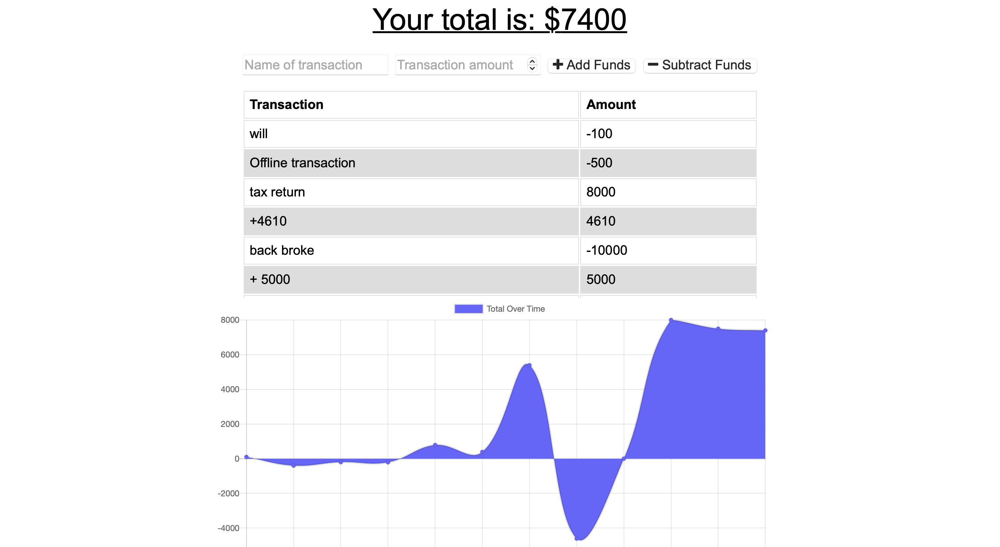

  <header align="center"> 
  <h1> 👓 Online-offline Budget Tracker 👓 </h1> 
  </header>

# User-Story

    I want to track my spending, I want to be able to access this app both when internet is accessable and when it is not.

# Table of contents

- [User-Story](#user-Story)
- [Description](#Description)
- [Screenshots](#Screenshots)
- [Installations](#installations)
- [Usage](#usage)
- [License](#license)
- [Contributing](#Contributing)
- [Testing-Procedure](#Testing-Procedure)
- [Contact](#contact)

# Description

    A budget tracker available online and offline, giving users the ability to continue using this web app when internet is unavailable!

# Screenshots

# Installations

    npm i to install all required dependencies.

# Usage

    npm start to run app

# Contributing

    N/A

# Testing-Procedure

    N/A

# Contact

If you would like to reach me in regards to either questions or comments, I am more than
happy to respond via github [Hayden-code](https://github.com/Hayden-code) or email [haychjones@gmail.com](haychjones@gmail.com).
